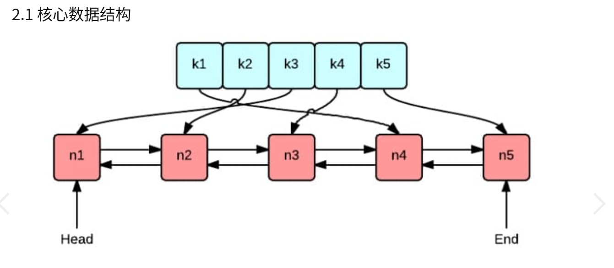
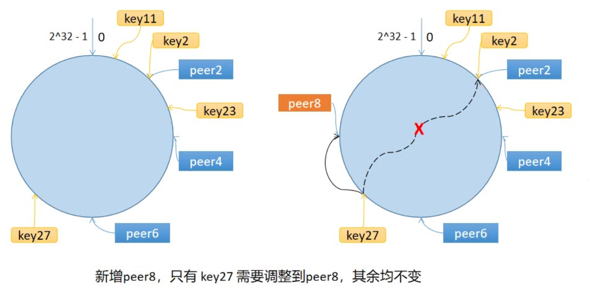
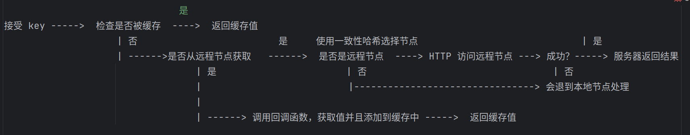

## 常用的三种缓存淘汰算法：FIFO，LFU 和 LRU
介绍常用的三种缓存淘汰(失效)算法：FIFO，LFU 和 LRU

实现 LRU 缓存淘汰算法，代码约80行

1 FIFO/LFU/LRU 算法简介

GeeCache 的缓存全部存储在内存中，内存是有限的，因此不可能无限制地添加数据。假定我们设置缓存能够使用的内存大小为 N，  
那么在某一个时间点，添加了某一条缓存记录之后，占用内存超过了 N，这个时候就需要从缓存中移除一条或多条数据了。那移除谁呢？  
我们肯定希望尽可能移除“没用”的数据，那如何判定数据“有用”还是“没用”呢 ？  

1.1 FIFO(First In First Out)

先进先出，也就是淘汰缓存中最老(最早添加)的记录。FIFO 认为，最早添加的记录，其不再被使用的可能性比刚添加的可能性大。这种算法的实现也非常简单，创建一个队列，新增记录添加到队尾，每次内存不够时，淘汰队首。但是很多场景下，部分记录虽然是最早添加但也最常被访问，而不得不因为呆的时间太长而被淘汰。这类数据会被频繁地添加进缓存，又被淘汰出去，导致缓存命中率降低。

1.2 LFU(Least Frequently Used)

最少使用，也就是淘汰缓存中访问频率最低的记录。LFU 认为，如果数据过去被访问多次，那么将来被访问的频率也更高。LFU 的实现需要维护一个按照访问次数排序的队列，每次访问，访问次数加1，队列重新排序，淘汰时选择访问次数最少的即可。LFU 算法的命中率是比较高的，但缺点也非常明显，维护每个记录的访问次数，对内存的消耗是很高的；另外，如果数据的访问模式发生变化，LFU 需要较长的时间去适应，也就是说 LFU 算法受历史数据的影响比较大。例如某个数据历史上访问次数奇高，但在某个时间点之后几乎不再被访问，但因为历史访问次数过高，而迟迟不能被淘汰。

1.3 LRU(Least Recently Used)

最近最少使用，相对于仅考虑时间因素的 FIFO 和仅考虑访问频率的 LFU，LRU 算法可以认为是相对平衡的一种淘汰算法。LRU 认为，如果数据最近被访问过，那么将来被访问的概率也会更高。LRU 算法的实现非常简单，维护一个队列，如果某条记录被访问了，则移动到队尾，那么队首则是最近最少访问的数据，淘汰该条记录即可。

##  LRU 算法实现

1. 绿色的是字典(map)，存储键和值的映射关系。这样根据某个键(key)查找对应的值(value)的复杂是O(1)，在字典中插入一条记录的复杂度也是O(1)。
2. 红色的是双向链表(double linked list)实现的队列。将所有的值放到双向链表中，这样，当访问到某个值时，将其移动到队尾的复杂度是O(1)，在队尾新增一条记录以及删除一条记录的复杂度均为O(1)。

## 使用一致性哈希
### 为什么使用
对于分布式缓存来说，当一个节点接收到请求，如果该节点并没有存储缓存值，那么它面临的难题是，从谁那获取数据？自己，还是节点1, 2, 3, 4… 。假设包括自己在内一共有 10 个节点，当一个节点接收到请求时，随机选择一个节点，由该节点从数据源获取数据。

假设第一次随机选取了节点 1 ，节点 1 从数据源获取到数据的同时缓存该数据；那第二次，只有 1/10 的可能性再次选择节点 1, 有 9/10 的概率选择了其他节点，如果选择了其他节点，就意味着需要再一次从数据源获取数据，一般来说，这个操作是很耗时的。这样做，一是缓存效率低，二是各个节点上存储着相同的数据，浪费了大量的存储空间。

那有什么办法，对于给定的 key，每一次都选择同一个节点呢？使用 hash 算法也能够做到这一点。那把 key 的每一个字符的 ASCII 码加起来，再除以 10 取余数可以吗？当然可以，这可以认为是自定义的 hash 算法。

从上面的图可以看到，任意一个节点任意时刻请求查找键 Tom 对应的值，都会分配给节点 2，有效地解决了上述的问题。

### 节点数量变化了怎么办？

简单求取 Hash 值解决了缓存性能的问题，但是没有考虑节点数量变化的场景。假设，移除了其中一台节点，只剩下 9 个，那么之前 hash(key) % 10 变成了 hash(key) % 9，也就意味着几乎缓存值对应的节点都发生了改变。即几乎所有的缓存值都失效了。节点在接收到对应的请求时，均需要重新去数据源获取数据，容易引起 缓存雪崩。

缓存雪崩：缓存在同一时刻全部失效，造成瞬时DB请求量大、压力骤增，引起雪崩。常因为缓存服务器宕机，或缓存设置了相同的过期时间引起。

那如何解决这个问题呢？一致性哈希算法可以。

## 算法原理
### 步骤

一致性哈希算法将 key 映射到 2^32 的空间中，将这个数字首尾相连，形成一个环。

1. 计算节点/机器(通常使用节点的名称、编号和 IP 地址)的哈希值，放置在环上。
2. 计算 key 的哈希值，放置在环上，顺时针寻找到的第一个节点，就是应选取的节点/机器。

环上有 peer2，peer4，peer6 三个节点，key11，key2，key27 均映射到 peer2，key23 映射到 peer4。此时，如果新增节点/机器 peer8，假设它新增位置如图所示，那么只有 key27 从 peer2 调整到 peer8，其余的映射均没有发生改变。

也就是说，一致性哈希算法，在新增/删除节点时，只需要重新定位该节点附近的一小部分数据，而不需要重新定位所有的节点，这就解决了上述的问题。

### 数据倾斜问题

如果服务器的节点过少，容易引起 key 的倾斜。例如上面例子中的 peer2，peer4，peer6 分布在环的上半部分，下半部分是空的。那么映射到环下半部分的 key 都会被分配给 peer2，key 过度向 peer2 倾斜，缓存节点间负载不均。

为了解决这个问题，引入了虚拟节点的概念，一个真实节点对应多个虚拟节点。

假设 1 个真实节点对应 3 个虚拟节点，那么 peer1 对应的虚拟节点是 peer1-1、 peer1-2、 peer1-3（通常以添加编号的方式实现），其余节点也以相同的方式操作。

第一步，计算虚拟节点的 Hash 值，放置在环上。
第二步，计算 key 的 Hash 值，在环上顺时针寻找到应选取的虚拟节点，例如是 peer2-1，那么就对应真实节点 peer2。

虚拟节点扩充了节点的数量，解决了节点较少的情况下数据容易倾斜的问题。而且代价非常小，只需要增加一个字典(map)维护真实节点与虚拟节点的映射关系即可。

## 缓存雪崩、缓存击穿与缓存穿透

缓存雪崩：缓存在同一时刻全部失效，造成瞬时DB请求量大、压力骤增，引起雪崩。缓存雪崩通常因为缓存服务器宕机、缓存的 key 设置了相同的过期时间等引起。

缓存击穿：一个存在的key，在缓存过期的一刻，同时有大量的请求，这些请求都会击穿到 DB ，造成瞬时DB请求量大、压力骤增。

缓存穿透：查询一个不存在的数据，因为不存在则不会写到缓存中，所以每次都会去请求 DB，如果瞬间流量过大，穿透到 DB，导致宕机。

### protobuf
protobuf 即 Protocol Buffers，Google 开发的一种数据描述语言，是一种轻便高效的结构化数据存储格式，与语言、平台无关，可扩展可序列化。protobuf 以二进制方式存储，占用空间小。

### 流程图

